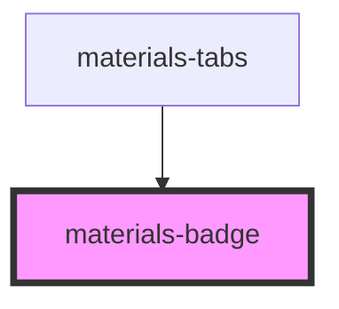

# materials-badge

<!-- Auto Generated Below -->

## CSS Custom Properties

| Name                          | Description                       |
| ----------------------------- | --------------------------------- |
| `--materials-badge-color`     | The background color of the badge |
| `--materials-badge-ink-color` | The text color of the badge       |

## Dependencies

### Used by

 - [materials-tabs](../tabs)

### Graph

----------------------------------------------

*Built with [StencilJS](https://stenciljs.com/)*
