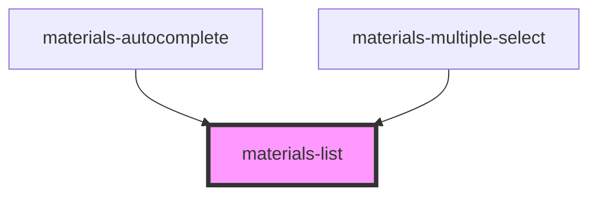

# materials-list

<!-- Auto Generated Below -->

## Properties

| Property     | Attribute    | Description                                                                 | Type                  | Default     |
| ------------ | ------------ | --------------------------------------------------------------------------- | --------------------- | ----------- |
| `dense`      | `dense`      | Optional, styles the density of the list, making it appear more compact.    | `boolean`             | `false`     |
| `multiple`   | `multiple`   | Optional, if the list is selectable it can be a multiple selection          | `boolean`             | `false`     |
| `selectable` | `selectable` | Optional, make a list selectable                                            | `boolean`             | `false`     |
| `size`       | `size`       | **[DEPRECATED]** use dense instead   | `"medium" \| "small"` | `undefined` |

## Dependencies

### Used by

 - [materials-autocomplete](..\autocomplete)
 - [materials-multiple-select](..\multiple-select)

### Graph

----------------------------------------------

*Built with [StencilJS](https://stenciljs.com/)*
