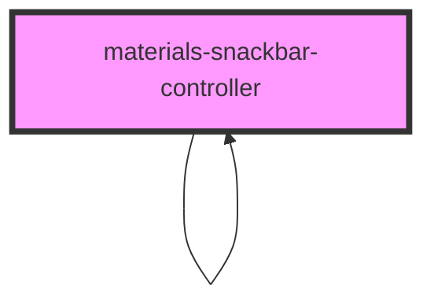

# materials-snackbar-controller

Snackbars provide brief messages about app processes at the bottom of the screen. Snackbar Controller allows to create Snackbars easily.

Material Design guidelines: https://material.io/components/snackbars

## Additional informations
### SnackBarOptions
| Property        | Attribute       | Description                                                        | Type       | Default   |
| --------------- | --------------- | ------------------------------------------------------------------ | ---------- | --------- |
| `label`         | `label`         | Message displayed in the Snackbar                                  | `string`   | `''`      |
| `actionText`    | `actionText`    | Text of action button (if any)                                     | `string`   | `''`      |
| `timeout`       | `timeout`       | Timeout for the Snackbar. Between 4000 and 10000                   | `number`   | `4000`    |
| `stacked`       | `stacked`       | Action buttons positioned below the label instead of alongside it  | `boolean`  | `false`   |
| `leading`       | `leading`       | Snackbar postioned in the leading edge of screen instead of center | `boolean`  | `false`   |
| `dismissButton` | `dismissButton` | Can be closed manually before timeout                              | `boolean`  | `false`   |
| `actionHandler` | `actionHandler` | Handler of the action button                                       | `Function` | `null`    |

<!-- Auto Generated Below -->

## Methods

### `create(options: SnackBarOptions) => Promise<void>`

Show a Snackbar

#### Returns

Type: `Promise<void>`

### `pushToQueue(snack: HTMLMaterialsSnackbarElement) => Promise<void>`

#### Returns

Type: `Promise<void>`

### `sliceQueue() => Promise<void>`

#### Returns

Type: `Promise<void>`

## Dependencies

### Used by

 - [materials-snackbar-controller]()

### Depends on

- [materials-snackbar-controller]()
- [materials-snackbar]()

### Graph

----------------------------------------------

*Built with [StencilJS](https://stenciljs.com/)*
