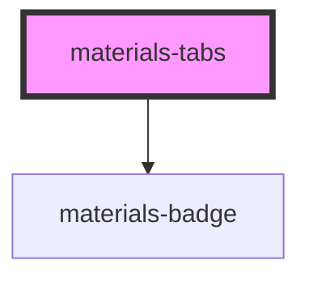

# materials-tabs

<!-- Auto Generated Below -->

## Properties

| Property        | Attribute        | Description                  | Type                                                    | Default        |
| --------------- | ---------------- | ---------------------------- | ------------------------------------------------------- | -------------- |
| `activeTab`     | `active-tab`     | Index de la tab sélectionner | `number`                                                | `0`            |
| `color`         | `color`          | Couleur de fond de la tabs   | `"background" \| "primary" \| "secondary" \| "surface"` | `'background'` |
| `indicatorType` | `indicator-type` | type d'indicateur            | `"icon" \| "underline"`                                 | `'underline'`  |
| `shrinkTabs`    | `shrink-tabs`    | Tabs de taille minimum       | `boolean`                                               | `false`        |

## Events

| Event       | Description                           | Type                                             |
| ----------- | ------------------------------------- | ------------------------------------------------ |
| `tabChange` | Envoie l'index de la tab sélectionner | `CustomEvent<{ index: number; label: string; }>` |

## CSS Custom Properties

| Name                              | Description                                  |
| --------------------------------- | -------------------------------------------- |
| `--materials-tab-badge-color`     | The background color of the badge in the tab |
| `--materials-tab-badge-ink-color` | The text color of the badge in the tab       |

## Dependencies

### Depends on

- [materials-badge](../badge)

### Graph

----------------------------------------------

*Built with [StencilJS](https://stenciljs.com/)*
