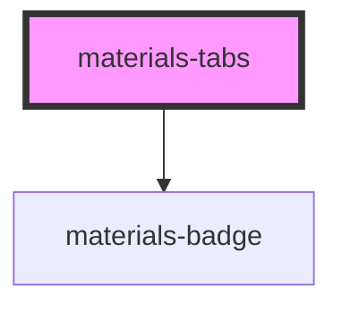

# materials-tabs

<!-- Auto Generated Below -->

## Properties

| Property        | Attribute        | Description | Type                                                    | Default        |
| --------------- | ---------------- | ----------- | ------------------------------------------------------- | -------------- |
| `activeTab`     | `active-tab`     |             | `number`                                                | `0`            |
| `color`         | `color`          |             | `"background" \| "primary" \| "secondary" \| "surface"` | `'background'` |
| `indicatorType` | `indicator-type` |             | `"icon" \| "underline"`                                 | `'underline'`  |
| `shrinkTabs`    | `shrink-tabs`    |             | `boolean`                                               | `undefined`    |

## Events

| Event       | Description | Type                  |
| ----------- | ----------- | --------------------- |
| `tabChange` |             | `CustomEvent<number>` |

## CSS Custom Properties

| Name                              | Description                                  |
| --------------------------------- | -------------------------------------------- |
| `--materials-tab-badge-color`     | The background color of the badge in the tab |
| `--materials-tab-badge-ink-color` | The text color of the badge in the tab       |

## Dependencies

### Depends on

- [materials-badge](../badge)

### Graph

----------------------------------------------

*Built with [StencilJS](https://stenciljs.com/)*
